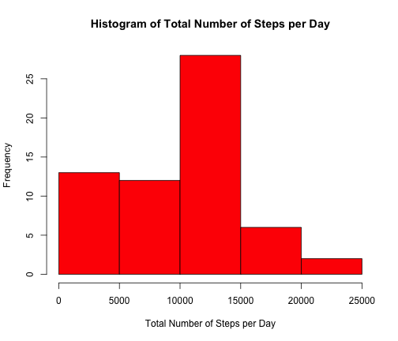
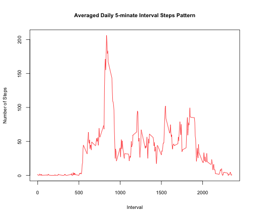
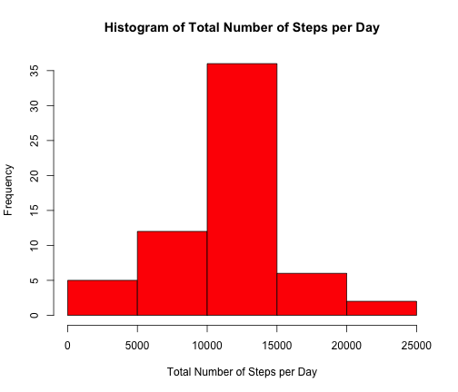
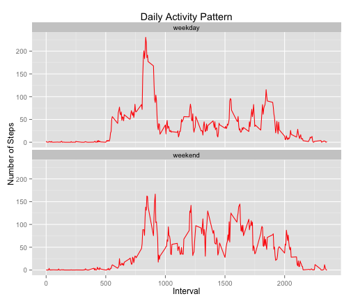

Reproducible Research: Peer Assessment 1
===========================================

#### By Jidan Zhong, 2015-Nov-10

## Loading and preprocessing the data

Load Data: Please make sure the data file is in your current working directory.


```r
data <- read.csv("./activity.csv")
```

### Q1: What is mean total number of steps taken per day?

Note: For this part of the assignment, the missing values in the dataset are ignored.

A histogram of the total number of steps taken each day is made to answer this question.


```r
data1 <- tapply(data$steps, data$date, sum, na.rm = TRUE)
hist(data1,xlab="Total Number of Steps per Day", main="Histogram of Total Number of Steps per Day",col="red")
```

 

Mean of total number of steps taken per day:

```r
mean(data1)
```

```
## [1] 9354.23
```
Median of total number of steps taken per day:

```r
median(data1)
```

```
## [1] 10395
```

### Q2: What is the average daily activity pattern?

The figure below shows a time series plot (i.e. type = "l") of the 5-minute interval (x-axis) and the average number of steps taken, averaged across all days (y-axis).


```r
data3 <- tapply(data$steps, data$interval,mean, na.rm = TRUE )
plot(names(data3),data3, xlab= "Interval",ylab= "Number of Steps",type="l",col="red", cex.axis=0.8, cex.lab=0.8)
title("Averaged Daily 5-minate Interval Steps Pattern",cex.main=0.9)
```

 

The 5-minute interval starting from the below time contains the maximum number of steps on average across all the days in the dataset:

```r
names(which.max(data3))
```

```
## [1] "835"
```

### Q3: Imputing missing values


The total number of missing values in the dataset (i.e. the total number of rows with NAs) is:

```r
sum(is.na(data$steps))
```

```
## [1] 2304
```

Strategy for filling in all of the missing values in the dataset: each missing value is filled in with the mean for that 5-minute interval across all the days with valid data.


```r
data_new <- data 
data4 <- which(is.na(data$steps)) # row index of which steps are NAs
for (i in 1 : length(data4))
  { ind <- match(data[data4[i],3],names(data3)) # looking for the matched 5-time interval
    data_new[data4[i],1] <- data3[ind] # fill the mean of the matched 5-time interval to the missing value
  }
```
"data_new" is the new dataset equal to the original dataset but with the missing data filled in.

Histogram of the total number of steps taken each day:

```r
data2 <- tapply(data_new$steps, data_new$date, sum)

hist(data2, xlab= "Total Number of Steps per Day",main = "Histogram of Total Number of Steps per Day",col="red")
```

 

Mean of total number of steps taken per day:

```r
mean(data2)
```

```
## [1] 10766.19
```
Median of total number of steps taken per day:

```r
median(data2)
```

```
## [1] 10766.19
```

These values differ from the estimates from the first part of the assignment with a difference (current value - old value):   

difference in mean:

```r
mean(data2) - mean(data1)
```

```
## [1] 1411.959
```
difference in median:

```r
median(data2) - median(data1)
```

```
## [1] 371.1887
```

The impact of imputing missing data on the estimates of the total daily number of steps:

  Both the mean and median are increased after filling in the missing values. As the data of the missing days were replaces with 0 in "data1", the mean and median were naturally smaller as it indluded some days with 0 steps.
  
### Q4: Are there differences in activity patterns between weekdays and weekends?

Note: The dataset with the filled-in missing values are used for this part.

Create a new factor variable "wkd" in the dataset with two levels -- "weekday" and "weekend" indicating whether a given date is a weekday or weekend day:


```r
wkd <- weekdays(as.Date(data$date))

wkd_f <- rep("weekday",time = length(wkd))  
wkd_f[grep("Saturday",wkd)] <- "weekend"
wkd_f[grep("Sunday",wkd)] <- "weekend"
data_new$wkd <- as.factor(wkd_f)
```

A panel plot containing a time series plot (i.e. type = "l") of the 5-minute interval (x-axis) and the average number of steps taken, averaged across all weekday days or weekend days (y-axis) is shown below:


```r
data_new1 <- tapply(data_new$steps[data_new$wkd=="weekend"], data_new$interval[data_new$wkd=="weekend"],mean) # weekend steps over the full interval
data_new2 <- tapply(data_new$steps[data_new$wkd=="weekday"], data_new$interval[data_new$wkd=="weekday"],mean) # weekday steps over the full interval

df <- data.frame(c(data_new1, data_new2), c(names(data_new1),names(data_new2)), c(rep("weekend",time = length(data_new1)),rep("weekday",time = length(data_new2))))

colnames(df) <- c("steps","interval","wkd")

# to plot the figure
suppressWarnings(library(ggplot2))

df$interval <- as.character(df$interval)
df$interval <- as.numeric(df$interval)
df$wkd <- as.character(df$wkd)
p4 <- ggplot(df, aes(x=interval, y=steps,fill=wkd)) +
  geom_line(colour="red") +
  facet_wrap(~wkd,ncol=1) +
  ggtitle("Daily Activity Pattern") +
  theme(legend.position="none") 
p4 + xlab("Interval") + ylab("Number of Steps") 
```

 
